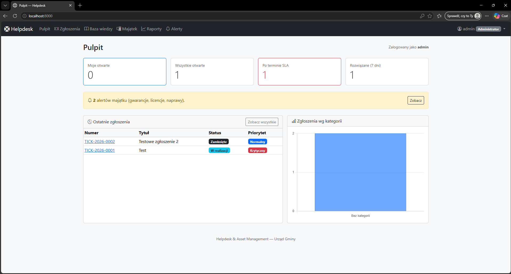
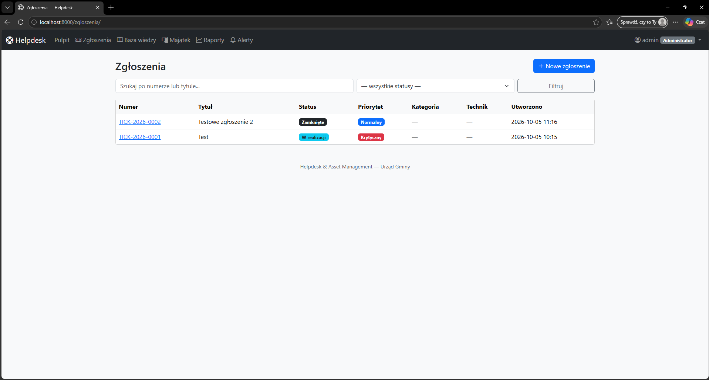
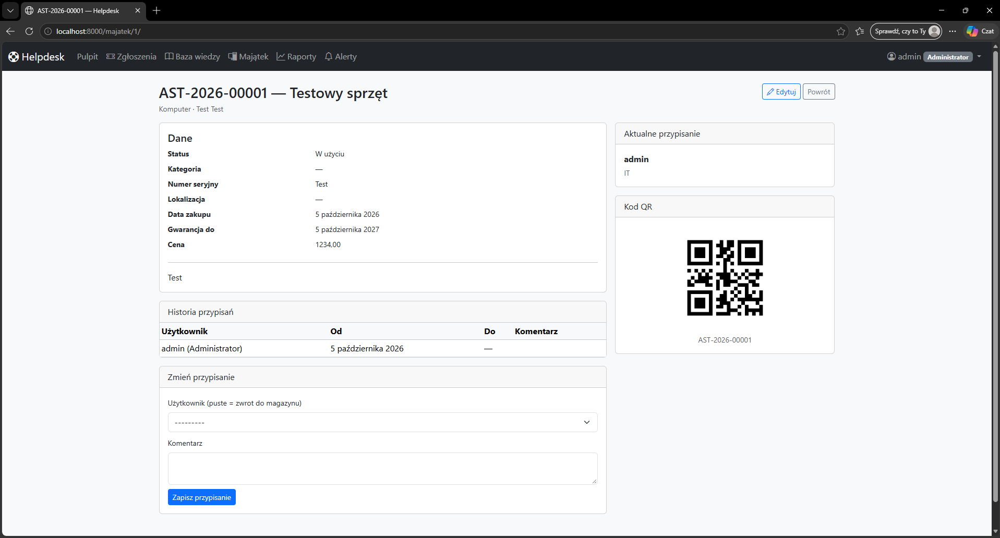
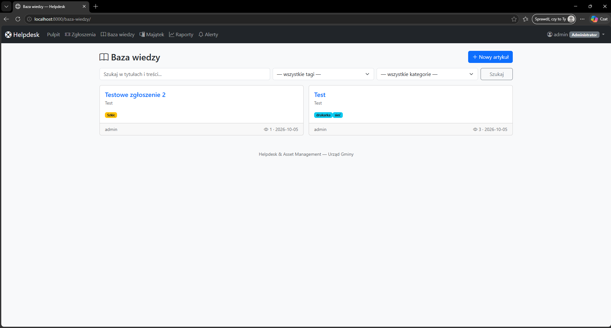
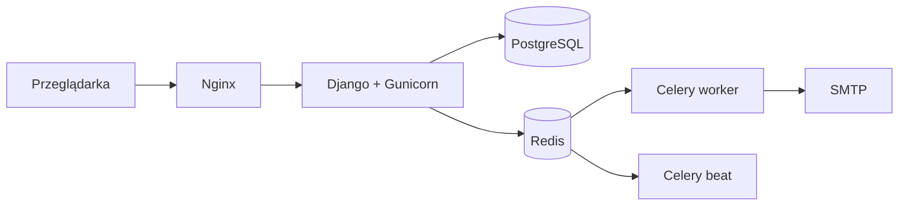

# Helpdesk & Asset Management

[](https://github.com/macioczaki/helpdesk/actions/workflows/ci.yml)


Kompletny system zgłoszeń IT, ewidencji majątku i bazy wiedzy — zbudowany w Django 5
z myślą o małych zespołach IT (1–3 osoby) i skali 50–200 użytkowników.

Projekt powstał jako realne wdrożenie w Urzędzie Gminy — obejmuje pełny cykl życia
zgłoszenia, inwentaryzację sprzętu z kodami QR, bazę wiedzy z wyszukiwaniem pełnotekstowym
oraz raporty i powiadomienia e-mail.

---

## Zrzuty ekranu

<table>
  <tr>
    <td width="50%"><br><sub>Pulpit z metrykami i wykresem</sub></td>
    <td width="50%"><br><sub>Lista zgłoszeń z filtrami</sub></td>
  </tr>
  <tr>
    <td width="50%"><br><sub>Szczegóły zasobu z kodem QR</sub></td>
    <td width="50%"><br><sub>Baza wiedzy z wyszukiwaniem</sub></td>
  </tr>
</table>

---

## Funkcje

### 🎫 Zgłoszenia
- Pełny cykl życia: `NOWE → W REALIZACJI → OCZEKUJE → ROZWIĄZANE → ZAMKNIĘTE`
- Priorytety i SLA z automatycznym terminem realizacji
- Komentarze publiczne i wewnętrzne (niewidoczne dla pracownika)
- Załączniki serwowane przez widok z kontrolą dostępu (nie przez `MEDIA_URL`)
- Pełna historia zmian pól (audyt)

### 💻 Majątek
- Rejestr sprzętu i licencji (kategorie, lokalizacje, przypisania)
- Kody QR i drukowalne etykiety PDF (A4, siatka 4×9)
- Skanowanie QR — szybkie wyszukanie zasobu
- Import z CSV, eksport do XLSX
- Alerty: kończąca się gwarancja, wygasające licencje, sprzęt w naprawie

### 📚 Baza wiedzy
- Artykuły z tagami, kategoriami i statusami
- Wyszukiwanie pełnotekstowe (PostgreSQL `tsvector` + indeks GIN)
- Licznik wyświetleń, powiązane artykuły
- Tworzenie artykułu bezpośrednio z zamkniętego zgłoszenia
- Podpowiedzi artykułów podczas tworzenia nowego zgłoszenia

### 📊 Dashboard i raporty
- Metryki na żywo (otwarte, przekroczone SLA, rozwiązane w tygodniu)
- Wykres zgłoszeń według kategorii (Chart.js)
- Raporty z zakresem dat i eksportem do XLSX (4 arkusze)

### ✉️ Powiadomienia
- E-mail do technika przy przypisaniu zgłoszenia
- E-mail do autora przy zmianie statusu i nowym komentarzu
- Dzienny digest dla techników (zgłoszenia po terminie SLA) — Celery Beat

---

## Stack

| Warstwa | Technologia |
|---|---|
| Backend | Python 3.12, Django 5.0 |
| Baza danych | PostgreSQL 16 |
| Kolejka i cache | Redis 7, Celery 5.4 |
| Frontend | Django Templates, Bootstrap 5.3, HTMX, Chart.js |
| Serwer produkcyjny | Gunicorn + Nginx + WhiteNoise |
| Konteneryzacja | Docker, Docker Compose |
| CI/CD | GitHub Actions |
| Testy | pytest, pytest-django, factory-boy |

---

## Architektura



Monolit Django z podziałem na aplikacje (`accounts`, `tickets`, `assets`, `kb`, `reports`).
Kluczowe decyzje architektoniczne opisane w [`docs/adr/`](docs/adr/):

- [ADR 0001 — Monolit Django zamiast mikroserwisów](docs/adr/0001-monolit-django.md)
- [ADR 0002 — HTMX zamiast SPA](docs/adr/0002-htmx-zamiast-spa.md)

---

## Szybki start (dev)

**Wymagania:** Docker Desktop, Git.

```bash
git clone git@github.com:macioczaki/helpdesk.git
cd helpdesk
cp .env.example .env

# wygeneruj sekret i wklej do .env jako DJANGO_SECRET_KEY
python3 -c "import secrets; print(secrets.token_urlsafe(64))"

docker compose up -d --build

# konto administratora
docker compose exec web python manage.py createsuperuser

# domyślne SLA (niski / normalny / wysoki / krytyczny)
docker compose exec web python manage.py seed_sla
```

- Aplikacja: <http://localhost:8000>
- Panel admina: <http://localhost:8000/admin/>

---

## Testy

```bash
docker compose exec web pytest
```

**40 testów** pokrywających:

- model użytkownika i role,
- cykl życia zgłoszenia, komentarze, historię zmian,
- powiadomienia e-mail (Celery eager),
- alerty majątku i uprawnienia widoków,
- wyszukiwanie pełnotekstowe w bazie wiedzy,
- raporty i eksport XLSX.

CI (GitHub Actions) uruchamia testy, `ruff` i `black` na każdy push i pull request.

---

## Struktura projektu

```
helpdesk/
├─ apps/
│  ├─ accounts/    # użytkownicy, role, działy
│  ├─ tickets/     # zgłoszenia, komentarze, SLA, historia
│  ├─ assets/      # majątek, przypisania, licencje, QR, import/eksport
│  ├─ kb/          # baza wiedzy z wyszukiwaniem pełnotekstowym
│  └─ reports/     # raporty i eksport XLSX
├─ config/
│  ├─ settings/    # base / dev / prod
│  ├─ urls.py
│  ├─ celery.py
│  └─ wsgi.py
├─ docker/         # Dockerfile, entrypoint, nginx.conf
├─ deploy/         # skrypty instalacji, aktualizacji, backupu
├─ docs/
│  ├─ adr/         # Architecture Decision Records
│  ├─ screenshots/ # zrzuty ekranu dla README
│  ├─ WDROZENIE.md
│  └─ UZYTKOWNIK.md
├─ templates/
├─ static/fonts/   # DejaVuSans dla PDF (polskie znaki)
├─ tests/
├─ docker-compose.yml
├─ docker-compose.prod.yml
└─ pyproject.toml
```

---

## Bezpieczeństwo

- HTTPS-only w produkcji (HSTS, `SECURE_SSL_REDIRECT`, `SECURE_PROXY_SSL_HEADER`)
- Ciasteczka sesji i CSRF tylko przez HTTPS
- Rate limiting na `/login/` (Nginx, 5 req/min)
- Załączniki za kontrolą dostępu — nie przez `MEDIA_URL`
- RBAC: `EMPLOYEE` / `TECHNICIAN` / `ADMIN`
- Audit log zmian w zgłoszeniach
- Sekrety w `.env` (nie w repo, `.env.example` z placeholderami)

---

## Wdrożenie produkcyjne

Pełna instrukcja: [`docs/WDROZENIE.md`](docs/WDROZENIE.md).

Skrót:

```bash
git clone git@github.com:macioczaki/helpdesk.git /opt/helpdesk
cd /opt/helpdesk
./deploy/install.sh
cp .env.prod.example .env   # uzupełnij sekrety, SMTP, domenę

# certyfikaty TLS do ./certs/
docker compose -f docker-compose.prod.yml up -d --build
docker compose -f docker-compose.prod.yml exec web python manage.py createsuperuser
docker compose -f docker-compose.prod.yml exec web python manage.py seed_sla
```

| Zadanie | Komenda |
|---|---|
| Aktualizacja | `./deploy/update.sh` |
| Backup bazy | `./deploy/backup.sh` (wpis w cronie) |
| Logi | `docker compose -f docker-compose.prod.yml logs -f web` |

Workflow CD (`.github/workflows/cd.yml`) jest przygotowany, ale domyślnie wyłączony —
włącza się przez ustawienie zmiennej repozytorium `DEPLOY_ENABLED=true`.

---

## Możliwe rozszerzenia

- 2FA (TOTP) dla administratorów
- Integracja LDAP / Active Directory
- REST API (DRF) dla klienta desktop/mobile
- Monitoring błędów (Sentry)
- Powiadomienia w aplikacji (dzwonek)

---

## Licencja

MIT — szczegóły w pliku [LICENSE](LICENSE).