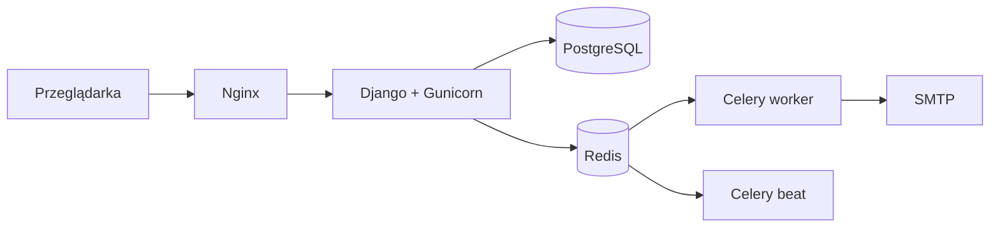

# Helpdesk & Asset Management

Wewnętrzny system zgłoszeń IT, ewidencji majątku i bazy wiedzy dla Urzędu Gminy.
Zbudowany w Django 5 z myślą o małym zespole IT (1–3 osoby) i skali 50–200 użytkowników.

---

## Funkcje

### Zgłoszenia
- Pełny cykl życia zgłoszenia: `NOWE → W REALIZACJI → OCZEKUJE → ROZWIĄZANE → ZAMKNIĘTE`
- Priorytety i SLA z automatycznym terminem realizacji
- Komentarze publiczne i wewnętrzne (wewnętrzne niewidoczne dla pracownika)
- Załączniki serwowane przez widok z kontrolą dostępu
- Historia zmian (audyt pól: status, priorytet, technik, kategoria)

### Majątek
- Rejestr sprzętu i licencji z kategoriami, lokalizacjami i przypisaniami
- Kody QR i drukowalne etykiety PDF (A4, siatka 4×9)
- Skanowanie QR — szybkie wyszukanie zasobu
- Import z CSV, eksport do XLSX
- Alerty: kończąca się gwarancja, wygasające licencje, sprzęt w naprawie

### Baza wiedzy
- Artykuły z tagami, kategoriami i statusami (szkic / opublikowany / zarchiwizowany)
- Wyszukiwanie pełnotekstowe (PostgreSQL `tsvector` + GIN)
- Licznik wyświetleń, powiązane artykuły
- Tworzenie artykułu bezpośrednio z zamkniętego zgłoszenia

### Dashboard i raporty
- Metryki na żywo (otwarte, przekroczone SLA, rozwiązane w tygodniu)
- Wykres zgłoszeń według kategorii (Chart.js)
- Raporty z zakresem dat, eksport do XLSX (4 arkusze: podsumowanie, kategorie, priorytety, technicy)

### Powiadomienia
- E-mail do technika przy przypisaniu zgłoszenia
- E-mail do autora przy zmianie statusu i nowym komentarzu
- Dzienny digest dla techników (zgłoszenia po terminie SLA) — Celery Beat

---

## Zrzuty ekranu


## Stack

| Warstwa | Technologia |
|---|---|
| Backend | Python 3.12, Django 5.0 |
| Baza danych | PostgreSQL 16 |
| Kolejka i cache | Redis 7, Celery 5.4 |
| Frontend | Django Templates, Bootstrap 5.3, HTMX |
| Serwer produkcyjny | Gunicorn + Nginx + WhiteNoise |
| Konteneryzacja | Docker, Docker Compose |
| CI/CD | GitHub Actions |
| Testy | pytest, pytest-django, factory-boy |

---

## Architektura



Monolit Django z podziałem na aplikacje (`accounts`, `tickets`, `assets`, `kb`, `reports`).
Decyzje architektoniczne opisane w [`docs/adr/`](docs/adr/).

---

## Szybki start (dev)

Wymagania: Docker Desktop, Git.

```bash
git clone git@github.com:macioczaki/helpdesk.git
cd helpdesk
cp .env.example .env
# wygeneruj sekret i wklej do .env jako DJANGO_SECRET_KEY
python3 -c "import secrets; print(secrets.token_urlsafe(64))"

docker compose up -d --build

# konto administratora
docker compose exec web python manage.py createsuperuser

# domyślne SLA (niski / normalny / wysoki / krytyczny)
docker compose exec web python manage.py seed_sla
```

Aplikacja: <http://localhost:8000>

Panel admina Django: <http://localhost:8000/admin/>

---

## Testy

```bash
docker compose exec web pytest
```

**40 testów** pokrywających:
- model użytkownika i role,
- cykl życia zgłoszenia, komentarze, historię zmian,
- powiadomienia e-mail,
- alerty majątku i uprawnienia widoków,
- wyszukiwanie pełnotekstowe w bazie wiedzy,
- raporty i eksport XLSX.

---

## Struktura projektu

```
helpdesk/
├─ apps/
│  ├─ accounts/    # użytkownicy, role, działy
│  ├─ tickets/     # zgłoszenia, komentarze, SLA, historia
│  ├─ assets/      # majątek, przypisania, licencje, QR, import/eksport
│  ├─ kb/          # baza wiedzy z FTS
│  └─ reports/     # raporty i eksport XLSX
├─ config/
│  ├─ settings/    # base / dev / prod
│  ├─ urls.py
│  ├─ celery.py
│  └─ wsgi.py
├─ docker/         # Dockerfile, entrypoint, nginx.conf
├─ deploy/         # skrypty instalacji, aktualizacji, backupu
├─ docs/
│  ├─ adr/         # Architecture Decision Records
│  ├─ WDROZENIE.md
│  └─ UZYTKOWNIK.md
├─ templates/
├─ static/fonts/   # DejaVuSans dla PDF
├─ tests/
├─ docker-compose.yml
├─ docker-compose.prod.yml
└─ pyproject.toml
```

---

## Bezpieczeństwo

- HTTPS-only w produkcji (HSTS, `SECURE_SSL_REDIRECT`)
- Ciasteczka sesji i CSRF tylko przez HTTPS
- Rate limiting na `/login/` (Nginx, 5 req/min)
- Załączniki za kontrolą dostępu — nie przez `MEDIA_URL`
- RBAC: `EMPLOYEE` / `TECHNICIAN` / `ADMIN`
- Audit log zmian w zgłoszeniach
- Sekrety w `.env` (nie w repo)

---

## Wdrożenie produkcyjne

Instrukcja krok po kroku: [`docs/WDROZENIE.md`](docs/WDROZENIE.md).

Skrót:

```bash
git clone git@github.com:macioczaki/helpdesk.git /opt/helpdesk
cd /opt/helpdesk
./deploy/install.sh
cp .env.prod.example .env   # uzupełnij sekrety, SMTP, domenę

# certyfikaty TLS do ./certs/
docker compose -f docker-compose.prod.yml up -d --build
docker compose -f docker-compose.prod.yml exec web python manage.py createsuperuser
docker compose -f docker-compose.prod.yml exec web python manage.py seed_sla
```

Aktualizacja: `./deploy/update.sh`
Backup bazy: `./deploy/backup.sh` (do crona)

---

## Status

✅ Wersja 1.0 — wdrożona w Urzędzie Gminy.

Możliwe rozszerzenia:
- 2FA dla administratorów
- integracja LDAP/Active Directory
- REST API (DRF) dla klienta desktop/mobile
- monitoring błędów (Sentry)

---

## Licencja

Projekt wewnętrzny — prawa autorskie należą do autora i Urzędu Gminy.
Kod udostępniany do wglądu; użycie komercyjne wymaga zgody.